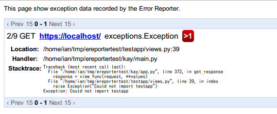
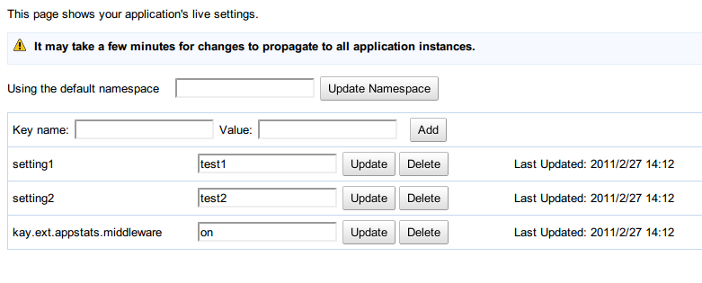

===============
kay.ext package
===============

.. Note::

    この機能はまだ試験的な機能なので、API はすこし変わる可能性があります。 

``kay.ext`` パッケージの機能を紹介します。

.. module:: kay.ext

kay.ext.appstats
======================

.. module:: kay.ext.appstats

``kay.ext.appstats`` は ``appstats`` を簡単に利用できることを支援する
ユティリティです。

Appstats について、詳しく調べたい場合は、 `Appstats for Python
<http://code.google.com/intl/en/appengine/docs/python/tools/appstats.html>`_ 
（英文）をご覧ください。

.. class:: kay.ext.appstats.middleware.AppStatsMiddleware 

appstats パッケージは Appstats 機能を有効にするミドルウエア
``AppStatsMiddleware`` というクラスがあります。
``kay.ext.appstats.middleware.AppStatsMiddleware`` を
:attr:`settings.MIDDLEWARE_CLASSES` に追加するだけで、 Appstats
を有効にすることができます。

.. code-block:: python

    MIDDLEWARE_CLASSES = (
        # ...
        'kay.ext.appstats.middleware.AppStatsMiddleware',
        # ...
    )

``app.yaml`` で、Appstats の管理画面を有効にすることも必要です。

.. code-block:: yaml

    builtins:
    - appstats: on

:mod:`kay.ext.live_settings` アプリを利用している場合は、
``AppStatsMiddleware`` を再デプロイせずに有効・無効にするように設定できます。
``kay.ext.appstats.middleware`` という設定を ``off``
に設定すると無効にすることができます。 有効にするには、 ``on``
に設定してください。

kay.ext.ereporter
======================

.. module:: kay.ext.ereporter

.. kay.ext.ereporter adds functionality for storing and viewing error reports generated by the application. The ereporter extension supports storing errors,
.. viewing errors and error frequency in the appengine admin console, and daily reports mailed to admins.

``kay.ext.ereporter``
はアプリケーションで発生したエラーの内容を保存する機能です。 ereporter
はエラー内容を保存し、管理画面で見ること、そして、デイリーレポートをメールで送信する機能を提要します。

インストール
-------------------------------

.. To install the kay.ext.ereporter application simply add 'kay.ext.ereporter' to your :attr:`settings.INSTALLED_APPS` setting in settings.py.

``kay.ext.ereporter`` アプリをインストールするには、 ``'kay.ext.ereporter'`` を :attr:`settings.INSTALLED_APPS` に追加してください。

.. code-block:: python

    INSTALLED_APPS = (
        # ...
        'kay.ext.ereporter',
        # ...

.. Once ereporter is installed, kay will not mail admins for each error that occurs in your application. Instead, it will record errors in the
.. datastore to be viewed later by admins. For large sites that may generate many errors, this can really help lighten the burden on your email
.. inbox.

ereporter をインストールした後に、アプリケーションの中にエラーが発生した場合、管理者にメールをせず、エラー内容をデータストアに保存します。
管理者は管理画面でエラーの内容、頻繁、トレースバックを見れます。アクセスが多くて、エラーがたくさん発生するサイトにかなり楽な機能です。

デイリーレポート
-------------------------------

.. In order to enable daily error reports, you will need to add the ereporter urls to your :attr:`settings.APP_MOUNT_POINTS` setting
.. in settings.pyand add the url to your ``cron.yaml`` file. You will need to set the sender to the email of a developer
.. assigned to your application in the appengine admin console. The following is an example daily report setup:

デイリーレポートを有効にするには、 ereporter の URL を
:attr:`settings.APP_MOUNT_POINTS` に追加します。そして、 ``cron.yaml`` に cron
用の URL を追加します。 Appengine
上では、送信者をアプリケーションの管理者(開発者)のメールアドレスに設定したいとメールが送信できませんので
ご注意ください。

**settings.py**:

.. code-block:: python

    APP_MOUNT_POINTS = {
      #...
      'kay.ext.ereporter': '/_kay/ereporter/',
      #...
    }

**cron.yaml**:

.. code-block:: yaml

    - description: Daily exception report
      url: /_kay/ereporter/?sender=system@example.com
      schedule: every day 00:00

.. The cron job supports several url parameters which can be added to the cron job url.

デイリーレポートの cron URL は以下のパラメターに対応します。

1. **sender**

.. This is the the email address that the daily report is send from. The email address must be registered as a developer
.. of your application.

デイリーレポートの送信者メールアドレス。Appengine
上では、送信者をアプリケーションの管理者(開発者)のメールアドレスに設定したいとメールが送信できませんので
ご注意ください。

2. **to**

.. This specifies the mail address to send the daily report. By default, if the to parameter is not specified the report
.. is sent to all developers registered with the application.

デイリーレポートの宛先メールアドレス。デフォールトは管理者(開発者)全員に送信します。

3. **date**

.. The date parameter specifies the date the report should be generated for. This is usually not specified and defaults to
.. yesterday, but can be specified to generate one off reports for a specific date. The date must be specified in YYYY-MM-YY format.

レポートの日付を指定します。普段はこのパラメターを使わないのですが、レポートが届かなかった場合などは、
このパラメターを使って、再送信することができます。 YYYY-MM-DD 形式で指定します。

4. **versions**

When deploying an updated version of an application, appengine creates a new minor version of the application.
versions can be specified to generate reports for all uploaded minor versions of the of the application or just the latest uploaded
version. The versions parameter accepts the values 'all' or 'latest'. Specifying 'all' will generate a report including all
versions, 'latest' will only include the current uploaded version of the application.

管理画面
-------------------------------

.. The custom admin page shows application errors in a simple interface that can be viewed in the appengine admin console. You can
.. enable the ereporter admin page by adding the ereporter to your :attr:`settings.APP_MOUNT_POINTS` and enabling the admin page in
.. your ``app.yaml``.

管理画面はアプリケーションのエラーの内容を表示します。 管理画面を有効にするには、 :attr:`settings.APP_MOUNT_POINTS` に URLを追加して、
管理画面を ``app.yaml`` に追加します。

**settings.py**:

.. code-block:: python

    APP_MOUNT_POINTS = {
      #...
      'kay.ext.ereporter': '/_kay/ereporter/',
      #...
    }

**app.yaml**

.. code-block:: yaml

    admin_console:
      pages:
      - name: Error Reporter Admin
        url: /_kay/ereporter/admin

kay.ext.nuke
============

nuke is a small tool for wipe all of your data in one action.

.. module:: kay.ext.nuke

To use kay.ext.nuke, firstly you need to retrieve bulkupdate copy from `github
repository <http://github.com/arachnid/bulkupdate>`_, put it under your project
directory, add ``kay.ext.nuke`` to your :attr:`settings.INSTALLED_APPS`
variable, and add these few lines to your ``app.yaml`` file.

.. code-block:: yaml

  admin_console:
    pages:
    - name: Bulk Update Jobs
      url: /_ah/bulkupdate/admin/
    - name: Nuke
      url: /_ah/nuke/
  
  handlers:
  - url: /_ah/nuke/.*
    script: kay/main.py
    login: admin
  
  - url: /_ah/bulkupdate/admin/.*
    script: bulkupdate/handler.py
    login: admin

Then you will see ``Nuke`` menu on your admin console, or you can just visit
``/_ah/nuke`` directly.

kay.ext.gaema
=============

kay.ext.gaema is a package for supporting authentication using some
social services. Currently following services are supported.

* google OpenID
* google OpenID/OAuth Hybrid
* Twitter OAuth
* Facebook Connect
* Yahoo OpenID

``kay.ext.gaema.services`` module has constants for these service
names:

* GOOG_OPENID
* GOOG_HYBRID
* TWITTER
* FACEBOOK
* YAHOO

All of following functions have ``service`` as its first argument, a
value of ``service`` must be one of service names above.

To use twitter or facebook, you need to register your application on
the service's website, and set your keys to
:attr:`settings.GAEMA_SECRETS` dictionary.

kay.ext.gaema.utils package has following functions.

.. module:: kay.ext.gaema.utils

.. function:: create_gaema_login_url(service, nexturl)

  A function for creating login_url for a particular social
  service. User will be redirected to the url specified by ``nexturl``
  argument after successfully logged in.

.. function:: create_gaema_logout_url(service, nexturl)

  A function for creating logout_url for a particular social
  service. User will be redirected to the url specified by ``nexturl``
  argument after successfully logged out.

.. function:: get_gaema_user(service)

  A function for retrieving current user's information as a
  dictionary. If the user is not signed in with a social service, it
  returns ``None``.

kay.ext.gaema.decorators package has following decorators.

.. module:: kay.ext.gaema.decorators

.. function:: gaema_login_required(\*services)

  A decorator for restricting access to a view only to users who is
  signed in with particular social service. You can pass any number of
  service.

Here is a simple example that shows how to authenticate users with twitter
OAuth. Firstly, you need to register your application on `Twitter's website
<http://twitter.com/apps>`_, and set a key and secret from twitter to
:attr:`settings.GAEMA_SECRETS` as well as :attr:`settings.INSTALLED_APPS`, and
activate ``kay.sessions.middleware.SessionMiddleware`` as follows:

.. code-block:: python

  INSTALLED_APPS = (
    'myapp',
    'kay.ext.gaema',
  )

  GAEMA_SECRETS = {
    "twitter_consumer_key": "hogehogehogehogehogehoge",
    "twitter_consumer_secret": "fugafugafugafugafugafugafugafuga",
  }

  MIDDLEWARE_CLASSES = (
    'kay.sessions.middleware.SessionMiddleware',
  )

Here is an example for views:

.. code-block:: python

  # -*- coding: utf-8 -*-
  # myapp.views

  import logging

  from werkzeug import Response
  from kay.ext.gaema.utils import (
    create_gaema_login_url, create_gaema_logout_url, get_gaema_user
  )
  from kay.ext.gaema.decorators import gaema_login_required
  from kay.ext.gaema.services import TWITTER
  from kay.utils import (
    render_to_response, url_for
  )

  # Create your views here.

  def index(request):
    gaema_login_url = create_gaema_login_url(TWITTER,
					     url_for("myapp/secret"))
    return render_to_response('myapp/index.html',
			      {'message': 'Hello',
			       'gaema_login_url': gaema_login_url})

  @gaema_login_required(TWITTER)
  def secret(request):
    user = get_gaema_user(TWITTER)
    gaema_logout_url = create_gaema_logout_url(TWITTER,
					       url_for("myapp/index"))
    return render_to_response('myapp/secret.html',
			      {'user': user,
			       'gaema_logout_url': gaema_logout_url})

kay.ext.live_settings
======================

.. module:: kay.ext.live_settings

Many applications have global settings which may need to be tweaked or modified
for performance and/or business reasons. However, modifying the settings.py
file requires developers to redeploy their application which can cause latency
spikes and other problems for high volume sites.

Live settings is a way for developers to create global application settings
that can be changed without redeploying the application. This can allow for
certain things like turning on and off appstats or other middleware without
redeploying an application.

Installation
----------------

The Live Settings extension is installed by adding ``kay.ext.live_settings`` to
your :attr:`settings.INSTALLED_APPS`.

.. code-block:: python

    INSTALLED_APPS = (
        # ...
        'kay.ext.live_settings',
        # ...
    )

Usage
-----------------

Live settings are string key to string value key-value pairs. These key-value
pairs are stored stored persistenly in the datastore and cached in instance
memory and in memcached. However, because of this caching, settings values may
take some time to propagate to all of your application instances.  Values in
instance memory time out every minute by default. Values in memcached are set
when settings are modified, and never expire (Though memcached keys can be
deleted due to lack of memory). This creates a tiered caching approach which
allows applications to retrieve settings values as quickly as possible while
still allowing them to be modified.

Getting and setting a setting key is easy:

.. code-block:: python

    from kay.ext.live_settings import live_settings

    value = live_settings.get("my.settings.key", "default_value")

    live_settings.set("my.settings.key", "new-value")

Settings can also be retrieved and set in bulk:

.. code-block:: python

    # Get settings in batch
    value = live_settings.get_multi(["my.settings.key", "my.other.setting"])
    
    my_setting = value["my.settings.key"]
    other_setting = value["my.other.setting"]

    # Set settings in batch
    live_settings.set_multi({
        "my.settings.key": "new_value",
        "my.other.setting": "other_value",
    })

Because the live settings feature extension relies on memcache and the
datastore live settings can be saved in seperate namespaces. By default live
settings are stored in the default namespace regardless of the current set
namespace. However, the namespace can be specified for each operation.

.. code-block:: python

    from kay.ext.live_settings import live_settings

    value = live_settings.get("my.settings.key", "default_value", namespace="mynamespace")

    live_settings.set("my.settings.key", "new-value", namespace="mynamespace")

The Custom Admin Page
-----------------------------------------------

Modifications to keys can be done via the Live Settings custom admin page as
well.  It may take a few minutes for settings to propagate to all application
instances.

The custom admin page is enabled by adding ``kay.ext.live_settings`` to your
:attr:`settings.APP_MOUNT_POINTS` and adding the custom admin page to the
``admin_console`` section of your ``app.yaml``.

**settings.py**:

.. code-block:: python

    APP_MOUNT_POINTS = {
        # ...
        'kay.ext.live_settings': '/_kay/live_settings/',
        # ...
    }

**app.yaml**:

.. code-block:: yaml

    admin_console:
      pages:
      - name: Live Settings Admin
        url: /_kay/live_settings/admin 
